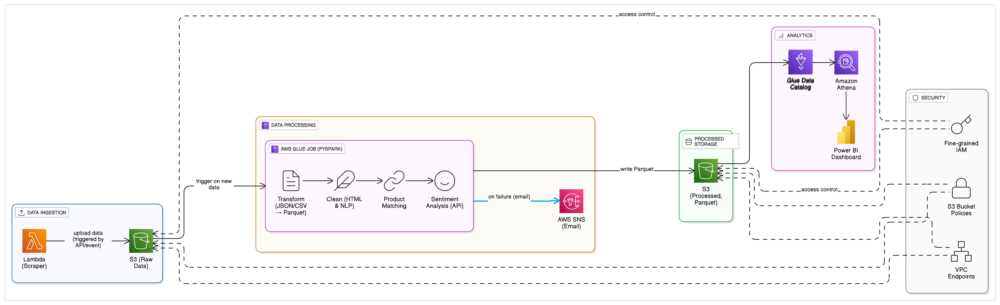

# Sentiment-Product-Mention
An end-to-end pipeline for detecting sentiment and product mentions in business feedback, leveraging AWS services and NLP techniques to transform raw customer feedback into actionable insights.
## 📌 Overview
This project aims to analyze customer feedback by identifying product mentions and determining the associated sentiment. By integrating various AWS services, the pipeline ensures scalability, efficiency, and real-time processing capabilities.

## 🧰 Features
- Product Mention Detection: Identifies and extracts product names from customer feedback.
- Sentiment Analysis: Classifies the sentiment (positive, negative, neutral) associated with each product mention.
- Scalable Architecture: Utilizes AWS services like Lambda, Glue, and Athena for seamless data processing and analysis.
- Visualization: Provides visual insights into product sentiments over time.

## 🗂️ Project Structure
Sentiment-Product-Mention/sourcecode \n
├── Scripts-Athena-create-table/   # Scripts to set up Athena tables \n
├── Scripts-DEMO/                  # Demo scripts showcasing pipeline usage \n
├── Scripts-on-GLUE/               # AWS Glue scripts for data processing \n
├── layers-on-lambda/              # Lambda layer configurations \n
├── model/                         # Pre-trained models and related assets \n
├── visualization/                 # Notebooks and scripts for data visualization \n
└── README.md        
