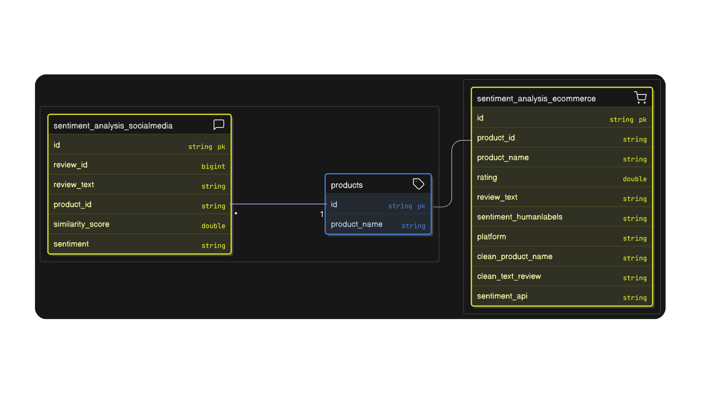
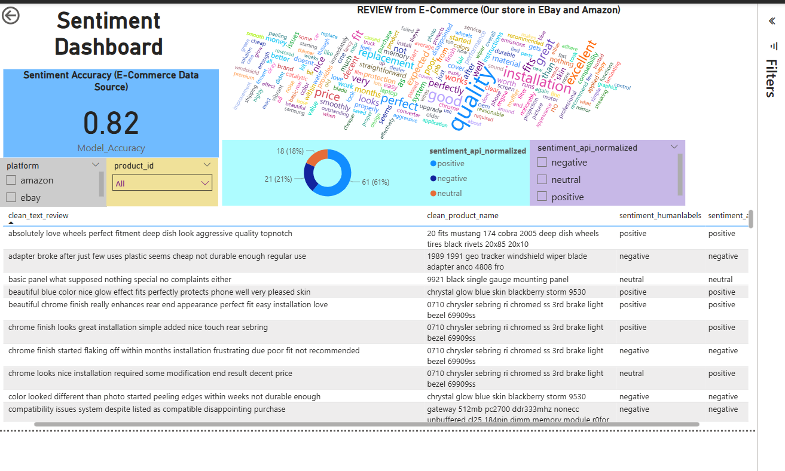

# Sentiment-Product-Mention
An end-to-end pipeline for detecting sentiment and product mentions in business feedback, leveraging AWS services and NLP techniques to transform raw customer feedback into actionable insights.
## 📌 Overview
This project aims to analyze customer feedback by identifying product mentions and determining the associated sentiment. By integrating various AWS services, the pipeline ensures scalability, efficiency, and real-time processing capabilities.

## 🧰 Features
- Product Mention Detection: Identifies and extracts product names from customer feedback.
- Sentiment Analysis: Classifies the sentiment (positive, negative, neutral) associated with each product mention.
- Scalable Architecture: Utilizes AWS services like Lambda, Glue, and Athena for seamless data processing and analysis.
- Visualization: Provides visual insights into product sentiments over time.

## 🗂️ Project Structure
sourcecode  
├── Scripts-Athena-create-table/&nbsp;&nbsp;&nbsp;_# Scripts to set up Athena tables_  
├── Scripts-DEMO/&nbsp;&nbsp;&nbsp;&nbsp;&nbsp;&nbsp;&nbsp;&nbsp;&nbsp;&nbsp;&nbsp;&nbsp;&nbsp;&nbsp;&nbsp;&nbsp;&nbsp;&nbsp;&nbsp;&nbsp;&nbsp;&nbsp;&nbsp;&nbsp;_# Demo scripts showcasing pipeline usage_  
├── Scripts-on-GLUE/&nbsp;&nbsp;&nbsp;&nbsp;&nbsp;&nbsp;&nbsp;&nbsp;&nbsp;&nbsp;&nbsp;&nbsp;&nbsp;&nbsp;&nbsp;&nbsp;&nbsp;&nbsp;&nbsp;&nbsp;_# AWS Glue scripts for data processing_  
├── layers-on-lambda/&nbsp;&nbsp;&nbsp;&nbsp;&nbsp;&nbsp;&nbsp;&nbsp;&nbsp;&nbsp;&nbsp;&nbsp;&nbsp;&nbsp;&nbsp;&nbsp;&nbsp;&nbsp;_# Lambda layer configurations_  
├── model/&nbsp;&nbsp;&nbsp;&nbsp;&nbsp;&nbsp;&nbsp;&nbsp;&nbsp;&nbsp;&nbsp;&nbsp;&nbsp;&nbsp;&nbsp;&nbsp;&nbsp;&nbsp;&nbsp;&nbsp;&nbsp;&nbsp;&nbsp;&nbsp;&nbsp;&nbsp;&nbsp;&nbsp;&nbsp;&nbsp;&nbsp;&nbsp;&nbsp;&nbsp;&nbsp;&nbsp;_# Pre-trained models and related assets_  
└── visualization/&nbsp;&nbsp;&nbsp;&nbsp;&nbsp;&nbsp;&nbsp;&nbsp;&nbsp;&nbsp;&nbsp;&nbsp;&nbsp;&nbsp;&nbsp;&nbsp;&nbsp;&nbsp;&nbsp;&nbsp;&nbsp;&nbsp;&nbsp;&nbsp;&nbsp;&nbsp;&nbsp;_# Notebooks and scripts for data visualization using PowerBI_      

## ⚙️ Technologies Used
- Programming Language: Python, PySpark
- Cloud Services:
  - AWS Lambda: Serverless compute service for running code in response to events.
  - AWS Glue: Managed ETL service for data preparation.
  - AWS Athena: Interactive query service for analyzing data in Amazon S3 using standard SQL.
  - AWS SNS: Alerted by email when an AWS Glue job fails.
  - AWS Cloudformation: Created Stack for model: Sentiment-api.
  - AWS S3: Data Storage
- NLP Libraries:
  - NLTK
  - sklearn: TfidfVectorizer, cosine_similarity
 
## 🚀 Getting Started
- Prerequisites:
  - AWS account with access to Lambda, Glue, Cloudformation and Athena services.
  - Python 3.x and PySpark installed locally.
